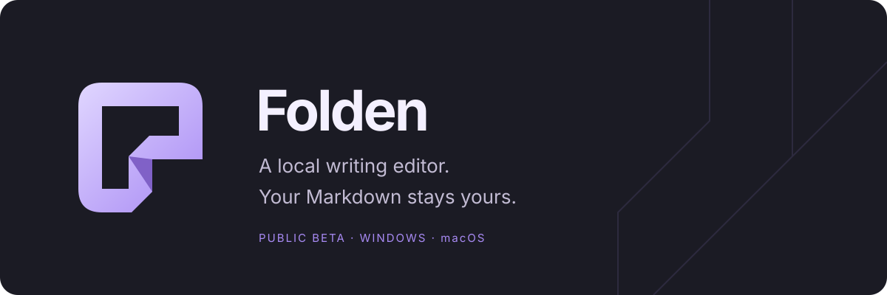
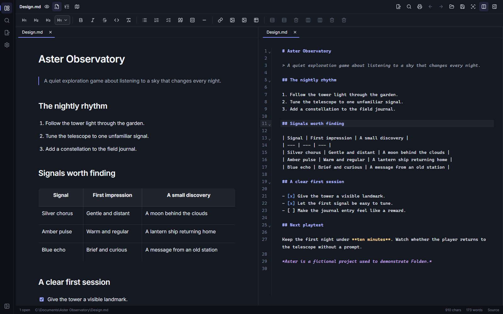

English · [Русский](README.ru.md)

**Write in Markdown. Keep your files.** Folden is a desktop editor for notes, articles, scripts, documentation, and game design documents. Work visually or edit the source, in one pane or two. Documents stay ordinary files on your computer.

## Beta 0.12.0

**This is a beta: bugs, crashes, and data loss may occur.** Folden is provided **“AS IS”, without warranties** under the [usage terms](LICENSE.md#warranty-and-liability). Keep independent backups of important documents.

[Download beta 0.12.0](https://github.com/byrnane/folden/releases/tag/v0.12.0).

[Release notes](docs/releases/v0.12.0.md) · [Verification status](docs/BETA-0.12.0.md)

The release contains three official installation packages and `SHA256SUMS.txt`; choose the package for your system. It also includes license texts and the NSIS source archive required by the installer's license.

| System              | Package          | Supported baseline |
| ------------------- | ---------------- | ------------------ |
| Windows x64         | `.exe` installer | Windows 10 / 11    |
| macOS Apple Silicon | ARM64 `.dmg`     | macOS 14 or newer  |
| macOS Intel         | x64 `.dmg`       | macOS 14 or newer  |

Linux has no official package or native acceptance in this beta. You may [build the unmodified source locally for your own use](docs/DEVELOPMENT.md#linux-self-build); redistribution remains prohibited. Other architectures and older systems are not part of this beta's supported baseline.

_A real view of the editor with fictional documents._

## A place for your writing

- Visual Markdown editing and a source editor, tabs, and two panes.
- A project folder tree, project search, quick open, and document find/replace.
- Headings, lists, tasks, tables, code blocks, and a document outline.
- Local image import and clipboard paste, relative document links, and navigation history.
- Templates for notes, articles, scripts, and design documents.
- Autosave for saved files, recovery for unsaved work, and comparison of conflicting external changes.
- File creation, renaming, moving, and deletion through the system trash.
- Printing and PDF export through your system print dialog.
- Russian and English interfaces, adjustable text sizes, and a dark theme.

Open a folder or a Markdown file to start. New drafts need an initial **Save** before autosave can write them to disk. Switch between visual and source modes to inspect the Markdown.

| Action         | Windows / Linux     | macOS       |
| -------------- | ------------------- | ----------- |
| Save           | `Ctrl+S`            | `⌘S`        |
| Quick open     | `Ctrl+P`            | `⌘P`        |
| Find / replace | `Ctrl+F` / `Ctrl+H` | `⌘F` / `⌘H` |
| Print / PDF    | `Ctrl+Alt+P`        | `⌘⌥P`       |

## Install

**Windows:** run the `.exe` installer. Updating an existing official installation keeps its application identifier and user settings. WebView2 is required; the installer can download Microsoft's runtime when it is missing. The beta is unsigned, so Windows may show an unknown-publisher or SmartScreen warning. Check the download source and checksum before choosing to run it.

**macOS:** choose the DMG for your processor, open it, and drag Folden into **Applications**. The beta has an ad-hoc signature and is not notarized. macOS may block the first launch; after verifying the source and checksum, use the app's entry in **System Settings → Privacy & Security → Open Anyway**. See [Apple's instructions](https://support.apple.com/en-us/102445).

## Privacy and limitations

Folden has no account, telemetry, or cloud sync. Documents and recovery data stay local. Remote images load only after your permission. Help and feedback buttons open GitHub in your browser. Diagnostic logs stay local; exporting them is a separate action. Review diagnostics and screenshots before sharing them.

The visual editor handles common Markdown; source mode remains available for syntax that needs exact control. The beta does not promise every Markdown dialect or cross-platform font and print-layout parity. Print/PDF depends on your system's webview and printer configuration. Unsigned packages trigger normal OS security warnings.

## Help and rights

[Report a problem](https://github.com/byrnane/folden/issues) with your OS, Folden version, and steps to reproduce. **Settings → Appearance → About Folden** contains help, version information, and licenses. See the [security policy](SECURITY.md) before reporting vulnerabilities; do not post sensitive documents or vulnerability details in public issues.

Official binaries are **free for personal and commercial use**. Your documents belong to you. The author's code is available for inspection, with a limited Linux self-build permission; other reuse and redistribution of third-party Folden builds are prohibited. This is a **source-available** project. See the [usage terms](LICENSE.md) and [third-party rights](LICENSE.md#third-party-components). Full third-party notices accompany official packages and are available in About → Licenses.

Created by **byrnane**. Technical instructions are in [Development](docs/DEVELOPMENT.md) and [Release](docs/RELEASE.md).
