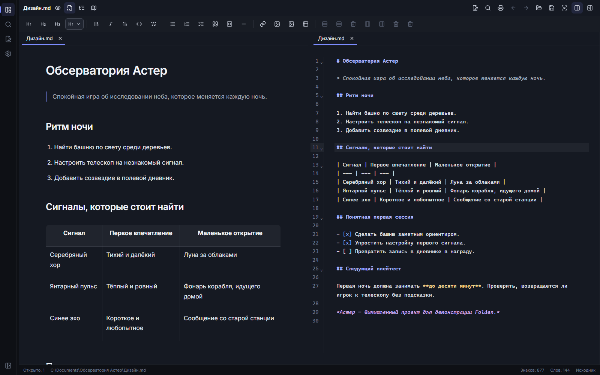

[English](README.md) · Русский

**Пишите в Markdown. Храните свои файлы.** Folden — настольный редактор для заметок, статей, сценариев, документации и игровых дизайн-документов. Работайте в визуальном редакторе или с исходным текстом, в одной панели или в двух. Документы остаются обычными файлами на вашем компьютере.

## Бета 0.12.0

**Выпуск готовится.** Скачать пакеты можно будет на [странице официальной беты](https://github.com/byrnane/folden/releases/tag/v0.12.0) после CI и приёмки на каждой целевой платформе.

[Что нового](docs/releases/v0.12.0.md) · [Статус проверок](docs/BETA-0.12.0.ru.md)

Сохраняйте резервные копии важных документов. На странице выпуска будут пять официальных установочных пакетов и `SHA256SUMS.txt`; выберите пакет для своей системы. Там же появятся тексты лицензий и архив исходников NSIS, который требуется лицензией установщика.

| Система             | Пакет               | Проверяемая база             |
| ------------------- | ------------------- | ---------------------------- |
| Windows x64         | Установщик `.exe`   | Windows 10 / 11              |
| Linux x64           | `.deb` или AppImage | Ubuntu 22.04 / 24.04 Desktop |
| macOS Apple Silicon | ARM64 `.dmg`        | macOS 14 и новее             |
| macOS Intel         | x64 `.dmg`          | macOS 14 и новее             |

Другие дистрибутивы, архитектуры и более старые системы пока не входят в поддерживаемую базу этой беты.

_Настоящий интерфейс редактора с вымышленными документами._

## Всё для работы с текстом

- Визуальный редактор Markdown и редактор исходного текста, вкладки и две панели.
- Дерево папки проекта, поиск по проекту, быстрое открытие, поиск и замена в документе.
- Заголовки, списки, задачи, таблицы, блоки кода и структура документа.
- Импорт и вставка локальных изображений, относительные ссылки на документы и история переходов.
- Шаблоны заметок, статей, сценариев и дизайн-документов.
- Автосохранение сохранённых файлов, восстановление несохранённой работы и сравнение внешних изменений при конфликте.
- Создание, переименование, перенос файлов и удаление через системную корзину.
- Печать и сохранение в PDF через системный диалог.
- Русский и английский интерфейсы, настройка размеров текста и тёмная тема.

Откройте папку или Markdown-файл. Новый черновик нужно сначала **сохранить**, чтобы автосохранение могло записывать его на диск. Переключайтесь между визуальным режимом и исходным текстом, когда нужно проверить Markdown.

| Действие         | Windows / Linux     | macOS       |
| ---------------- | ------------------- | ----------- |
| Сохранить        | `Ctrl+S`            | `⌘S`        |
| Быстрое открытие | `Ctrl+P`            | `⌘P`        |
| Поиск / замена   | `Ctrl+F` / `Ctrl+H` | `⌘F` / `⌘H` |
| Печать / PDF     | `Ctrl+Alt+P`        | `⌘⌥P`       |

## Установка

**Windows:** запустите установщик `.exe`. Обновление существующей официальной установки сохраняет идентификатор приложения и настройки. Нужен WebView2; при его отсутствии установщик может скачать среду Microsoft. Бета не подписана доверенным сертификатом, поэтому Windows может показать предупреждение SmartScreen или неизвестного издателя. Проверьте источник файла и контрольную сумму перед запуском.

**Ubuntu:** установите `.deb` командой `sudo apt install ./<package>.deb`. Для AppImage разрешите выполнение файла как программы в его свойствах, затем запустите. AppImage может потребовать FUSE; если он не запускается, используйте `.deb`.

**macOS:** выберите DMG для своего процессора, откройте его и перенесите Folden в **Applications**. Бета имеет ad-hoc подпись и не нотарифицирована. macOS может заблокировать первый запуск; после проверки источника и контрольной суммы разрешите открытие через **Системные настройки → Конфиденциальность и безопасность → Всё равно открыть**. [Инструкция Apple](https://support.apple.com/ru-ru/102445).

## Приватность и ограничения

В Folden нет аккаунтов, телеметрии и облачной синхронизации. Документы и данные восстановления хранятся локально. Сетевые изображения загружаются с вашего разрешения. Кнопки помощи и обратной связи открывают GitHub в браузере. Журналы остаются локальными; экспорт диагностики запускается отдельно. Проверяйте диагностику и скриншоты перед отправкой другим людям.

Визуальный редактор поддерживает распространённый Markdown; исходный режим доступен для синтаксиса, который требует точного контроля. Бета не обещает поддержку всех диалектов Markdown и одинаковые шрифты или вёрстку печати на разных ОС. Печать/PDF зависят от системного webview и принтера. Неподписанные доверенным сертификатом пакеты вызывают стандартные предупреждения ОС.

## Поддержка и права

[Сообщите о проблеме](https://github.com/byrnane/folden/issues), указав ОС, версию Folden и шаги воспроизведения. В разделе **Настройки → Внешний вид → О Folden** доступны помощь, версия и лицензии. Перед сообщением об уязвимости прочитайте [политику безопасности](SECURITY.md); не публикуйте её детали и конфиденциальные документы в открытых issues.

Официальные сборки **бесплатны для личных и рабочих задач, включая коммерческие**. Ваши документы принадлежат вам. Авторские исходники доступны для ознакомления; переиспользование кода и распространение сторонних сборок запрещены. Это проект с **доступными исходниками**, не свободная лицензия. Подробности — в [условиях использования](LICENSE.md) и [правах сторонних компонентов](LICENSE.md#third-party-components). Полные тексты лицензий входят в официальные пакеты и доступны в «О приложении → Лицензии».

Автор — **byrnane**. Технические инструкции вынесены в [документацию разработчика](docs/DEVELOPMENT.ru.md) и [процедуру выпуска](docs/RELEASE.ru.md).
